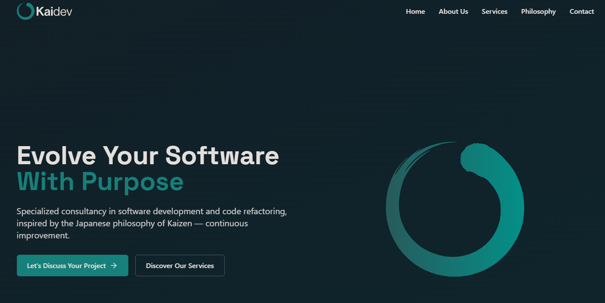

# Kaidev Landing Page

A modern, responsive landing page for Kaidev, a consultancy specializing in software development and code refactoring, built with Next.js and Tailwind CSS.



## 🚀 Technologies Used

This project leverages the following technologies:

- **[Next.js 14](https://nextjs.org/)** - React framework with App Router
- **[React 18](https://reactjs.org/)** - JavaScript library for building user interfaces
- **[TypeScript](https://www.typescriptlang.org/)** - Typed JavaScript
- **[Tailwind CSS](https://tailwindcss.com/)** - Utility-first CSS framework
- **[Lucide React](https://lucide.dev/)** - Beautiful & consistent icon set
- **[Tailwind Typography](https://github.com/tailwindlabs/tailwindcss-typography)** - Beautiful typographic defaults

## 📋 Prerequisites

Before you begin, ensure you have the following installed:

- Node.js (v18.17.0 or higher)
- npm or yarn or pnpm

## 🛠️ Getting Started

Follow these steps to get the project running on your local machine:

1. **Clone the repository**

```bash
git clone https://github.com/yourusername/kaidev-landing.git
cd kaidev-landing
```

2. **Install dependencies**

```bash
npm install

# or

yarn install

# or

pnpm install
```

3. **Run the development server**

```bash
npm run dev

# or

yarn dev

# or

pnpm dev
```

4. **Open your browser**

Navigate to [http://localhost:3000](http://localhost:3000) to see the website in action.

## 📁 Project Structure

```
kaidev-landing/
├── app/ # Next.js App Router
│ ├── layout.tsx # Root layout component
│ ├── page.tsx # Home page component
│ └── globals.css # Global styles
├── components/ # React components
│ ├── navbar.tsx # Navigation bar
│ ├── hero-section.tsx # Hero section
│ ├── about-section.tsx # About section
│ └── ... # Other components
├── public/ # Static assets
│ └── images/ # Image files
├── tailwind.config.ts # Tailwind CSS configuration
└── ... # Other configuration files
```

## 🎨 Style Guide

The project follows Kaidev's brand guidelines:

### Colors

```typescript
// Primary Colors
kaidevTeal: "#16807A", // Main brand color
graphiteCore: "#2C2F36", // Main typography, visual structures
warmWhite: "#E4DFDB", // Logos on dark backgrounds
softPaper: "#F3F4F4", // General background

// Secondary Colors
inkCharcoal: "#353837", // Refined black variant
silentJade: "#6CA6A2", // Emotional decorative color
systemGrey: "#444444", // Technical grey for UI

// Gradient
kaidevGradientFrom: "#2D6969", // Gradient start
kaidevGradientTo: "#00ABA0", // Gradient end

// Special Background
heroColor: "#10161F", // For hero sections
```

### Typography

- **Headings**: Space Grotesk (alternative to Neue Haas Grotesk)

  - H1: Space Grotesk Bold
  - H2: Space Grotesk SemiBold
  - H3: Space Grotesk Regular

- **Body Text**: Inter
  - Paragraphs: Inter Regular
  - Descriptions: Inter Light
  - Highlights: Inter Bold
  - Quotes: Inter Italic

### Logo Usage

- **Main Version**: Horizontal logo
- **Vertical Version**: For featured pieces
- **Isotype Only**: Where space is limited
- **Safety Space**: Maintain minimum distance around logos
- **Minimum Sizes**:
  - Horizontal Logo: Minimum 100px wide
  - Vertical Logo: Minimum 70px high
  - Isotype: Minimum 36px high

## 🔧 Customization

### Modifying Content

Most of the website content can be modified directly in the component files:

- Update text in each section component
- Replace images in the `/public/images/` directory
- Modify contact information in `contact-section.tsx`
- Update testimonials in `testimonials-section.tsx`

### Changing Styles

The project uses Tailwind CSS for styling:

1. Global styles are in `app/globals.css`
2. Brand colors and other theme extensions are in `tailwind.config.ts`
3. Component-specific styles are applied using Tailwind classes in each component

### Adding New Sections

To add a new section:

1. Create a new component in the `components/` directory
2. Import and add the component to `app/page.tsx`
3. Add a navigation link in `components/navbar.tsx` if needed

## 📦 Building for Production

To build the project for production:

```bash
npm run build

# or

yarn build

# or

pnpm build
```

To preview the production build:

```bash
npm run start

# or

yarn start

# or

pnpm start
```

## 🚀 Deployment

This Next.js application can be deployed on various platforms:

### Vercel (Recommended)

The easiest way to deploy your Next.js app is to use the [Vercel Platform](https://vercel.com/new).

### Other Platforms

For deployment to other platforms like Netlify, AWS, or traditional hosting, refer to the [Next.js deployment documentation](https://nextjs.org/docs/deployment).

## 📄 License

This project is licensed under the MIT License - see the LICENSE file for details.

## 🙏 Acknowledgements

- Design based on Kaidev's brand guidelines
- Icons from [Lucide React](https://lucide.dev/)
- Fonts from [Google Fonts](https://fonts.google.com/)
